---

# Borderless


Say Hello to a Borderless World!

Borderless is a platform to share your adventures with an enthusiastic community of adventurers.
Your best moments worth be a memory, BorderLess is a platform to record
your travels, tracks or any adventure around the world. Be without limits, Be borderless, enjoy a whole world with breathtaking landscapes, different colors, cultures and share with your friends with your notes, advices and suggestions.

[Click here to see the project live](https://borderless-project.herokuapp.com/)

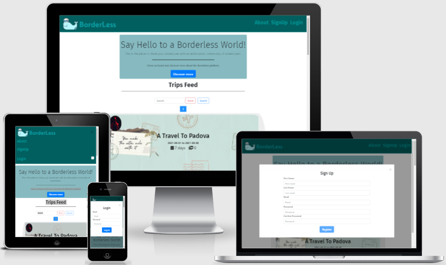

---

## Tables of Contents

- [Borderless](#borderless)
- [Tables of Contents](#tables-of-contents)
- [UX](#ux)
  - [The purpose of the website is to present the follow values:](#the-purpose-of-the-website-is-to-present-the-follow-values)
  - [User Stories:](#user-stories)
- [Design Process:](#design-process)
  - [Framework](#framework)
  - [Wireframing the project on Balsamiq](#wireframing-the-project-on-balsamiq)
- [Features](#features)
  - [Existing Features](#existing-features)
  - [Future Implementations](#future-implementations)
- [Technologies Used](#technologies-used)
  - [Front-End Technologies](#front-end-technologies)
  - [Back-End Technologies](#back-end-technologies)
- [Testing](#testing)
  - [Testing User Stories](#testing-user-stories)
  - [Validating The HTML and CSS code](#validating-the-html-and-css-code)
  - [Testing in different browsers](#testing-in-different-browsers)
  - [Testing responsiveness](#testing-responsiveness)
  - [Issues found](#issues-found)
- [Accessibility](#accessibility)
- [Deployment](#deployment)
  - [Deploying my project](#deploying-my-project)
- [Cloning my project](#cloning-my-project)
- [Credits](#credits)
  - [Content](#content)
  - [Acknowledgements](#acknowledgements)

---

## UX

### The purpose of the website is to present the follow values:
  * Share your best moments in travels, short trips, vacation, hikings and so on.
  * Share your opnion about a place, with suggestions, advices and photos.
  * Encourage interaction between users with the the relationship and likes functionality.
  * Create a resposive design, wich works in different screen sizes and devices, due the fact that people use more mobile devices nowadays.

### User Stories:

  *"As a user, I would like to _____________________________"*

  * *view the site from any device (mobile, tablet, desktop).*
  * *view all trip posts as a guest.*
  * *view all trip as a guest.*
  * *view public profile as a guest.*
  * *search trip posts by trip name and place.*
  * *create my own profile.*
  * *choose my trip post privacy.*
  * *edit my own profile.*
  * *add my own trips.*
  * *edit my own trips.*
  * *delete my own trips.*
  * *be able to like and dislike a trips.*
  * *be able to follow or unfollow other users.*
  * *be able to receive a notification when another user send a follow request.*
  * *be able to to remove a follower.*
  * *be able see my followers and following users in my profile.*
  * *be able see a statistic about my trips in my profile.*
  * *be able to log out.*

Back to the [Tables of Contents](#tables-of-contents)

---  

## Design Process:

  ### Framework
  * [Bootstrap](https://getbootstrap.com/):
    * Bootstrap is a responsive mobile-first design framework with a clean and modern layout, with its simple-to-understand documentation.
  * [Jquery](https://jquery.com/):
    * In an effort to keep the JavaScript minimal, I have decided to use jQuery as foundation to my scripts framework.
  * [Flask](https://flask.palletsprojects.com/en/2.0.x/):
    * Flask is a microframework that I've used to render the back-end Python with the front-end Bootstrap.


  ### Wireframing the project on Balsamiq
  * [Balsamiq](https://balsamiq.com/):
    * Software used to build the wireframe of this project. Because Code Institute have provided all students with free access for a limited time and the simplicity and ease of use.

  * **The wireframe can be seen here**:
    * [Wireframe](app/static/files/readme/borderless_wireframe.pdf)

Back to the [Tables of Contents](#tables-of-contents)

---

## Features

### Existing Features

  * This project has nine separate pages, which are:
    * **"Feed"** page (which is the first page), where the user can see all public trips posted;
    * **"About"** page which contains a brief information about the platform with a button to open the sign up modal form;
    * **"Profile"** page where the user can see and manipulate your own trips, profile or relationships (followers and following);
    * **"Public Profile"** page where the user can see others user's profile and send a relationship request (follow/unfollow);
    * **"Edit Profile"** page where the user can find a form to update his profile;
    * **"Edit Trip"** page where the user can find a form to update a trip;
    * **"Trip"** page where the user can see all informations about a trip.
    * **404 and 500 error page** to handle these erros.

  * **Register Account**:
    * Anybody can register for free and create their own unique account. I have built-in authentication and authorization to check certain criteria is met before an account is validated. All passwords are hashed for security purposes. When an user is registered in the database, a folder for this user is automaticly created in the cloud platform to hold all pictures of his account. ([see cloud folders diagram when user is registered](app/static/files/readme/register-cloud-folder-diagram.pdf))
    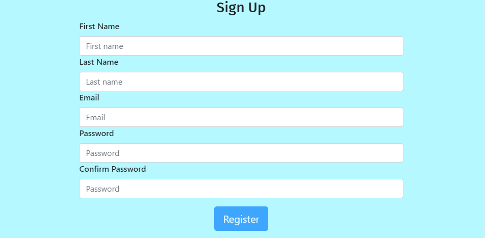

  * **Log In to Account**:
    * For existing users, I have more authentication and authorization incorporated to check that the hashed passwords and username match the database.
    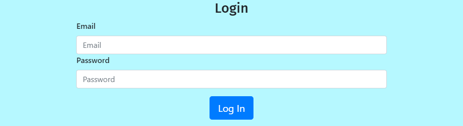

  * **Log Out of Account**:
    * Users can easily log out of their account with the click of a button.
    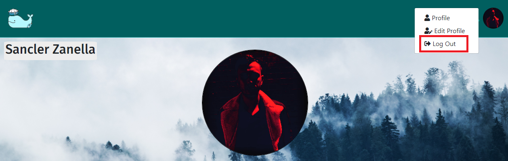
  
  * **Navbar**:
    * The navbar is different, depending whether the user is logged in or not. If the user is not logged in, the logo will be the brand logo picture with the brand name, and the items will be "About" (Which redirects to about page), "Sign Up" (Which open a sign up form) and "Login" (Which open a log in form). If the user is logged in the logo will be just the brand logo picture, and the items will be a globe icon (which redirects to feed page), user's avatar (Which is a dropdown menu with the option to visit profile, edit profile and log out), a bell icon (Which is a dropdown menu where the user can find his notifications), if there is notification to the user, the bell icon will be solid, with there is no notification to the user, the bell icon will be outlined.
    
      * Navbar when the user is logged:
      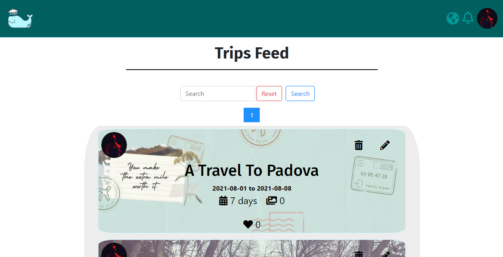

      * Navbar when the user is logged out:
      
  
  * **View All Trip Posts**:
    * On the *feed page*, all trip posts are initially displayed in an date order, being ordered by the latest initial trip date to oldest trip date, with a standard 10-items per page using pagination.
        * [Feed Page](https://borderless-project.herokuapp.com/)
  
  * **Search Trips**:
    * If a user would like to search for something specific, whether it's a particular trip or a certain place, then the Search bar is perfect.
      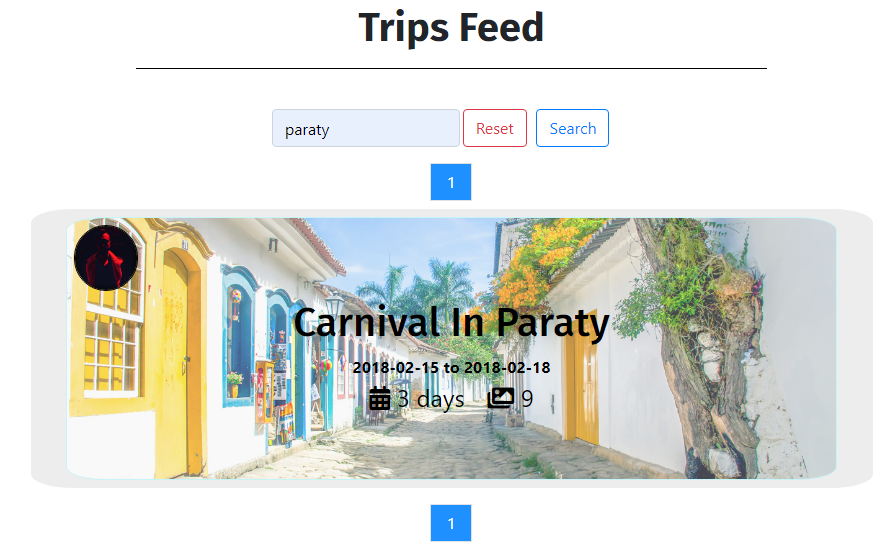
  
  * **Add a Trip**:
    * Create or 'add' a new trip. The 'Add New Trip' button can be found in the profile page. Defensive programming in place means users must adhere to minimal requirements when adding a new trip like fill required fields and limit the number of photos will be posted. If a user doesn't have a photo to accompany their trip, I have a built-in function that will automatically assign a placeholder image. A folder named by the trip category is created in the cloud platform to hold a folder named by the trip name which contains the trip pictures. ([see trips folder diagram](app/static/files/readme/trips-cloud-folder-diagram.pdf))
      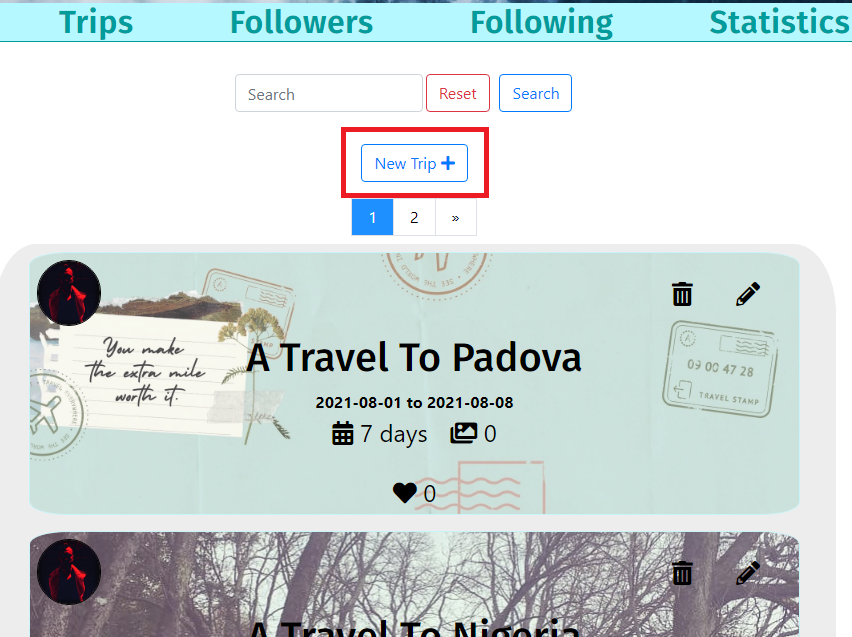
      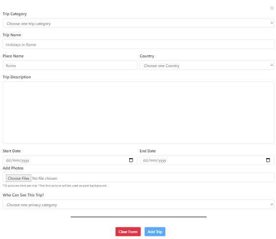
  
  * **Trip Post**:
    * Trip post can be found in the profile, public profile and feed pages. It's a link to the trip view and trip author's public profile, with a minimal information about the trip. From here, users also have additional options:

      1. **Delete the trip:**
         * Delete trip from database and trip folder in the cloud platform, with a defensive message to avoid accidental deletion. All pictures are moved to the delete folder in the cloud which is a stage before complete deletion;
      2. **Edit the trip:**
         * Allow user to update all informations about the trip in the data base and in the cloud platform, in the edit trip form there is section to se the current photos and allow user to delete any of the current photos on click (with a defensive message), there is a section to preview the new photos that will be uploaded. Depending on whether the user change the trip name, category or both, the trip photo will be moved to another new folder in the cloud;
      3. **Like/Unlike the trip:**
         * Allow user to like or deslike the trip post. Demonstrates the popularity of the post and can be an indicator of the post quality;
      4. **Access Trip View:**
         * Access trip view through trip's name on the post, which is a link;
      5. **Access Author Public Profile:**
         * Access trip's author clicking in the author's avatar picture on the post

    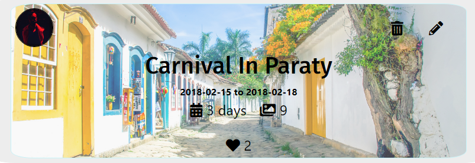

  * **Trip View**:
    * View all information about the trip with a map pointing the place location in the world, in this page the user is able to find the trip name, trip place (place and country), trip period (start date and end date), trip description and trip photos, which can be expanded on click.
      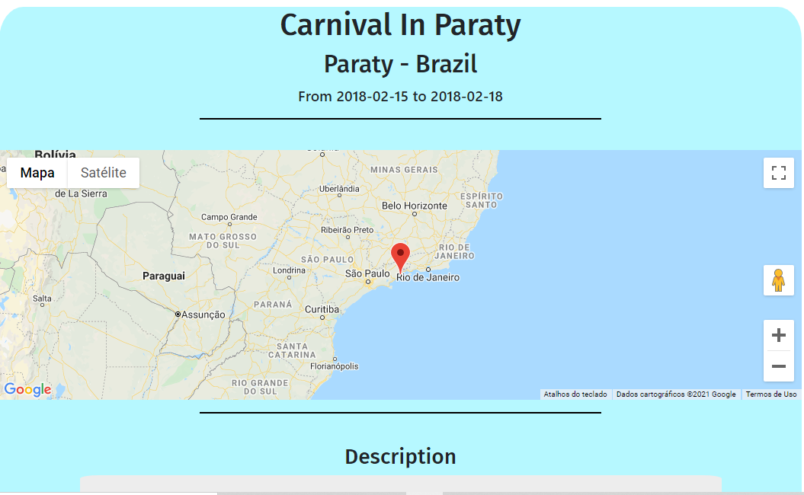
      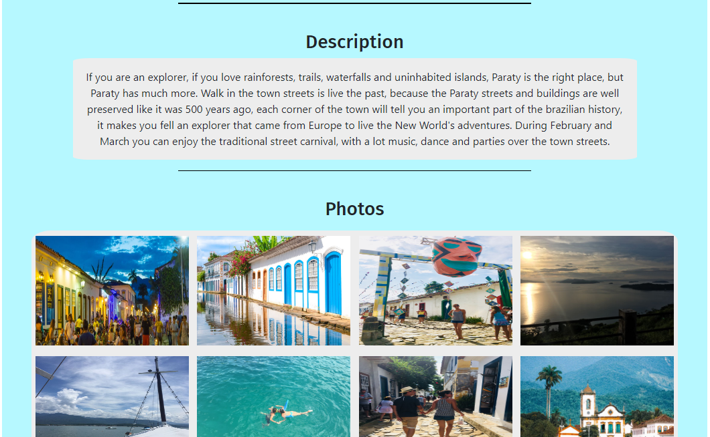

  * **Edit Profile**:
    * Allow user to update profile Name and choose a new avatar and cover picture, beside the file input for choose the new avatar and cover picture there is a preview of the current avatar and cover picture. If the user choose new pictures to the profile, the old pictures will be overwriten in cloud folder.
    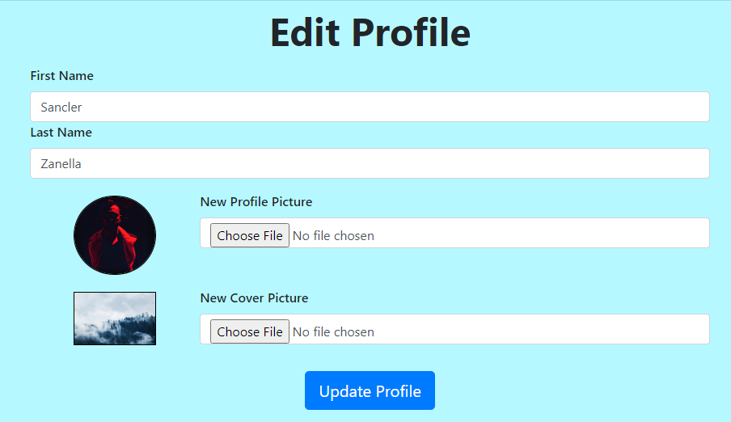

  * **Followers Tab**:
    * It's a part of the profile and public profile where the user can find the followers of that profile's owner, in this tab the user will find a the followers's avatar and name, which is clickble and open a dropdown menu, with the option of visit the follower's profile or remove the follower.
    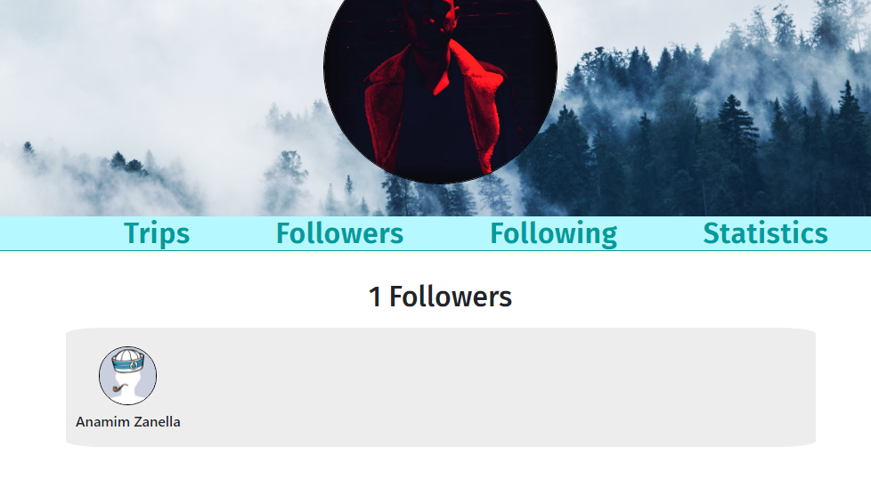

  * **Following Tab**:
    * It's a part of the profile and public profile where the user can find other users he is following, in this tab the user will find a the following's avatar and name, which is clickble and open a dropdown menu, with the option of visit the following profile or unfollow.
    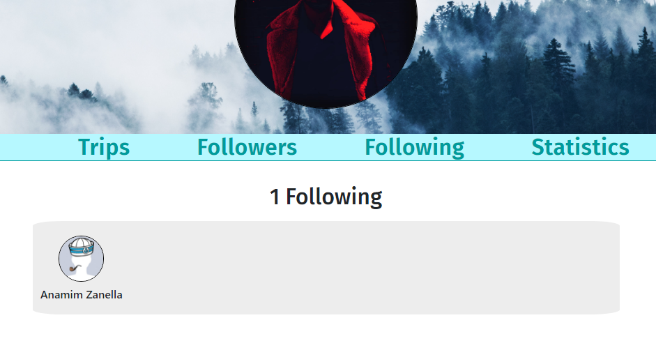

  * **Statistics Tab**:
    * It's a part of the profile and public profile pages where the user can see some statistics like the number of "countries visited" and "places visited", amount of "days traveling", "longest time traveling" and the "total of photos".
    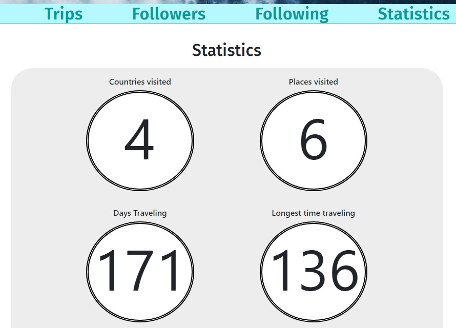

  * **Follow/Unfollow Button**:
    * It's a part of the public profile page where any user can send a follow request to another user or Unfollow.
    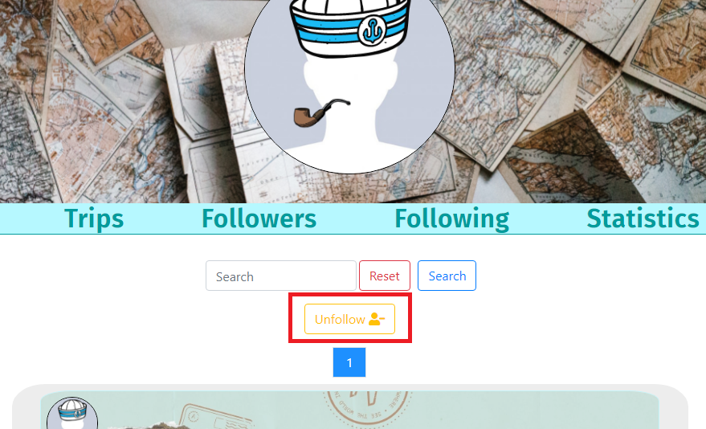

Back to the [Tables of Contents](#tables-of-contents)

### Future Implementations

  * Add comments to the trip posts.

  * Add the option to create a list of favorite trips.

  * Change pagination to infinite scroll with lazy loading.

Back to the [Tables of Contents](#tables-of-contents)

---

## Technologies Used

  * [Gitpod](https://gitpod.io/)
    * Used as my primary IDE for coding. Gitpod is an open source platform for automated and ready-to-code development environments that blends into your existing workflow directly from your browser.
  
  * [GitHub](https://github.com/)
    * Used as remote storage of my code online. A company that provides hosting for software development version control using Git.

  * [Code Institute Full Template](https://github.com/Code-Institute-Org/gitpod-full-template)
    * Used as a basic template to kick start the project.

  * [Balsamiq](https://balsamiq.com/)
    * Used for wireframing the project. [see wireframe](app/static/files/readme/borderless_wireframe.pdf)

  * [Google Sheets](https://www.google.com/sheets/about/)
      * Used to create the database schema. [See data base schema](app/static/files/readme/NoSQL_Schema.pdf) 

  * [Lucidchart](https://www.lucidchart.com/)
    * Used to build cloud folders diagrams. [see main diagram](app/static/files/readme/register-cloud-folder-diagram.pdf) / [see trips diagram](app/static/files/readme/trips-cloud-folder-diagram.pdf)
  
  * [Chrome Dev Tools](https://developers.google.com/web/tools/chrome-devtools)
    * A set of web developer tools built directly into the Google Chrome browser. I used these tools constantly thoughout the development cycle.
  
  * [Canva](https://www.canva.com/)
    * I used the Canva platform to make the style guide.

  * [TinyPNG](https://tinypng.com/)
    * I used TinyPNG to compress my image files to try to reduce the loading time for each page.
  
  * [W3C markup validation service](https://validator.w3.org/)
    * Great tool to support throught the web development that helps to test and find issues on markup file.

  * [CSS validation service](https://jigsaw.w3.org/css-validator/)
    * Great tool to support throught the web development that helps to test and find issues on style file.
  
  * [W3C Schools](https://www.w3schools.com/)
    * W3C Schools is a great platform that covers all aspects of web development, great tools that provides information for developers.

  * [Stack Overflow](https://stackoverflow.com/)
    * Although it isn't a technology, I found a lot of guidance on Stack Overflow.

  * [MND Web Docs](https://developer.mozilla.org/en-US/docs/Web)
    * DN Web Docs, previously Mozilla Developer Network and formerly Mozilla Developer Center, is a documentation repository for web developers used by Mozilla, Microsoft, Google, and Samsung.

  * [CSS-tricks](https://css-tricks.com/)
    * Is a blog where you can find lots of tutorial and tricks to write a good css.

Back to the [Tables of Contents](#tables-of-contents)

  ### Front-End Technologies

  * [HTML 5](https://en.wikipedia.org/wiki/HTML5)
    * Used as the base for markup text. The language used to build the structure and add its content.

  * [CSS3](https://en.wikipedia.org/wiki/CSS)
    * Used as the base for cascading styles. The language used to style the HTML5 elements according to the design and color scheme.

  * [Bootstrap framework](https://getbootstrap.com/)
    * Used as the overall design framework. I decided to use Bootstrap's grid container system as I wanted to design my project with a 'mobile first' approach, but another bootstrap resources were used like the contact form.

  * [FontAwesome](https://fontawesome.com/)
    * FontAwesome icons is where I got most part of the icons for my design project.

  * [Google Fonts](https://fonts.google.com/)
    * I used Google fonts to provide the fonts of the website.

  * [Jquery](https://jquery.com/):
    * Used as the primary JavaScript functionality. In an effort to keep the JavaScript minimal, I have decided to use jQuery as foundation to my scripts framework.

Back to the [Tables of Contents](#tables-of-contents)
  
  ### Back-End Technologies

  * [Flask](https://flask.palletsprojects.com/en/2.0.x/):
    * Used as a microframework.

  * [Flask Blueprints](https://flask.palletsprojects.com/en/1.0.x/blueprints/):
    * Used to split the python code for routes.

  * [Jinja](https://jinja.palletsprojects.com/en/2.10.x/):
    * Used for templating with Flask.

  * [Werkzeug](https://werkzeug.palletsprojects.com/en/0.16.x/):
    * Used for password hashing, authentication, and authorization.

  * [Cloudinary](https://cloudinary.com/)
    * Used to store users's pictures

  * [Heroku](https://www.heroku.com/what)
    * Used for app hosting.
  
  * [Python 3.9.6](https://www.python.org/)
    * Used as the back-end programming language.
  
  * [MongoDB Atlas](https://www.mongodb.com/pt-br)
    * Used to store my database in the 'cloud'.
  
  * [PyMongo](https://pypi.org/project/pymongo/)
    * Used as the Python API for MongoDB.

Back to the [Tables of Contents](#tables-of-contents)

---

## Testing

### Creating an Account

I've created my own personal account. In addition to this primary account, I've tested with about 5 fake accounts in order to confirm authentication and validation worked as expected. The authentication and validation to create an account consists in:

1. Check if the Sign up form is properly filled out.
    * If the "First name" and "Last name" fields are filled out, with a minimum length of 2 characters and maximum of 15 characters;
      ```html
      <!-- First Name Field -->
      <div class="row no-gutters content-alignment">
          <div class="col-8">
              <label for="fname">First Name</label>
              <input type="text" id="fname" name="fname" minlength="5" maxlenght="15"
                  pattern="^[a-zA-Z0-9]{2,15}$" class="form-control"
                  placeholder="First name" required>
          </div>
      </div>

      <!-- Last Name Field -->
      <div class="row no-gutters content-alignment">
          <div class="col-8">
              <label for="lname">Last Name</label>
              <input type="text" id="lname" name="lname" minlength="5" maxlenght="15"
                  pattern="^[a-zA-Z0-9]{2,15}$" class="form-control"
                  placeholder="Last name" required>
          </div>
      </div>
      
      ```
      - Checking if the above fields are filled out:
      

      - Checking if the above fields have the right length:
      

    * If the "Email" field is filled out with the properly email format;
      ```html
      <!-- Email Field -->
      <div class="row no-gutters content-alignment">
          <div class="col-8">
              <label for="email">Email</label>
              <input type="email" id="email" name="email" class="form-control"
                  placeholder="Email" required>
          </div>
      </div>

      ```
      - Checking if the email field has the right format:
      

    * If the "Password" and "Confirm Password" field are properly filled out with a minimum length of 6 characters and maximum of 15 characters and if these fields match, in case of these fields not match, the register button "Register" keep disabled.
      ```html
      <!-- Password Field -->
      <div class="row no-gutters content-alignment">
          <div class="col-8">
              <label for="password">Password</label>
              <input type="password" id="password" name="password" minlenght="6"
                  maxlenght="15" pattern="^[a-zA-Z0-9]{5,15}$" class="form-control"
                  placeholder="Password" required>
          </div>
      </div>

      <!-- Repeat Password Field -->
      <div class="row no-gutters content-alignment">
          <div class="col-8">
              <label for="Rpassword">Confirm Password</label>
              <input type="password" id="Rpassword" name="Rpassword" minlenght="6"
                  maxlenght="15" pattern="^[a-zA-Z0-9]{5,15}$" class="form-control"
                  placeholder="Password" required>
          </div>
      </div>

      ```
      - Checking if the above fields have the right length:
      

      - If the above fields match, then "Register" button is no longer disabled:
        * Match:
          
        * No Match:
          

2. Check if the user already exists in the database, using the email as parameter, if the user already exists, the return to the previous page with a flash message which says "User already exists";
    ```python
    # Check if the username already exists in db
    existing_user = users_collections.find_one(
        {"email": request.form.get("email")})

    if existing_user:
        flash("User already exists")

        # redirect to previous page if the users already exists
        return redirect(request.referrer)
    ```

### Log in

I've tested the log in form and functionality in all initial pages, filling the form with the correct values and different values to try to catch any unexpected error, authentication and validation worked as expected. The authentication and validation to log in consists in:

1. Check if the Log in form is properly filled out.
    * If the "Email" field is filled out with the properly email format;

      - Checking if the email field has the right format:
      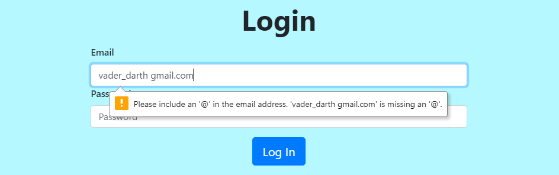

    * If the "Password" field is properly filled out with a minimum length of 6 characters and maximum of 15 characters.

      - Checking if the password field has the right length:
      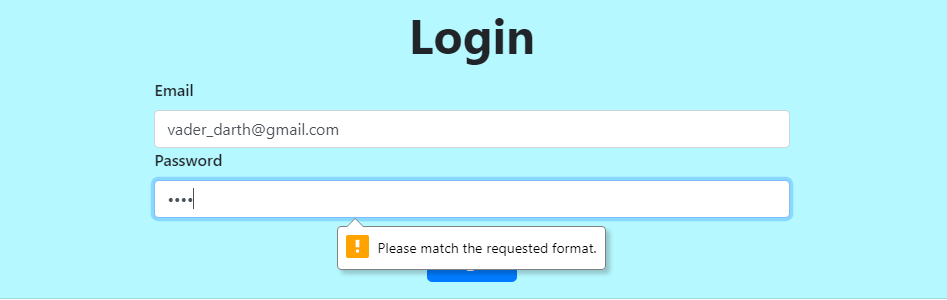

2. Check if the user exists in the database, using the email as parameter, in the case the user exists in the database, then check if the password match with the password stored in the database. If the email or password is incorrect, then reload the previous page with a flash message, which is "Incorrect email and/or password";

### Add, Edit and Delete a Trip Post

Several trip posts were created in order to prepare for pagination building. These trip posts were created using my actual account, the admin account, and several test accounts.

For several posts, I've edited minor things to test all parts of a trip post, adding place and country, description, photos and creating without photos to test the functionality of creating and updating a trip post to the database and cloud platform.

### Pagination

When implementing pagination, I had a lot of manual tests to undergo, in order to make pagination work for multiple scenarios. I needed to test that all aspects of pagination worked with and without the option for searching the database. These included:

* Pagination without Search
  * Pagination works if no URL args present on initial load;
  * Previous Page button disabled on first page of trips shown;
  * Next Page button disabled on last page of all trips shown;
  * Appropriate number of pages appear based on the number of 10 items per page in the feed page or 5 items in the profile and public profile pages with correct number of trips in database;
  * Additional page numbers appear if more trips are added;
  * Each page number returns their correct page URL.

- Pagination without search query:
  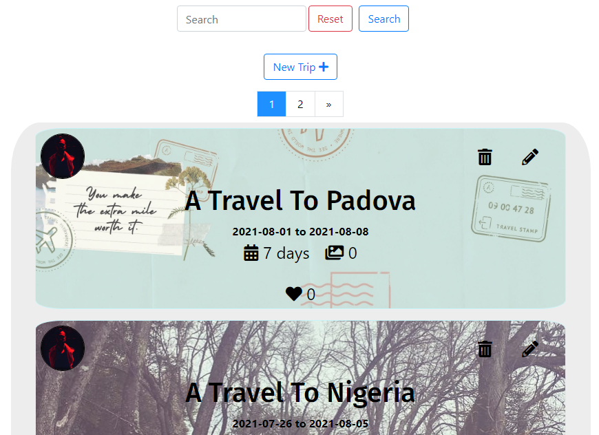

* Pagination with Search
  * Pagination works if no URL args present on initial search;
  * Previous Page button disabled on first page of search results;
  * Next Page button disabled on last page of search results;
  * Additional page numbers appear if more trips are added.
  * Each page number returns their correct page URL.

- Pagination with search query:
  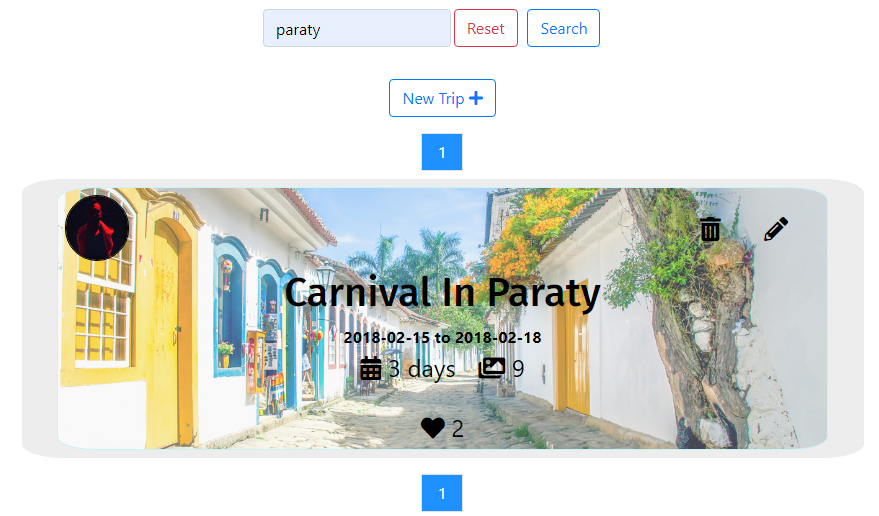

### Trip Post

I've checked the trip post in different pages (Profile, Public Profile and Feed). Each user is just allowed to modify or delete your own trip posts, in this case the delete trip button and edit trip button need to be hidden in other users trip posts. The like button can't be seen with the user is logged out.

- Trip post delete and edit buttons:
  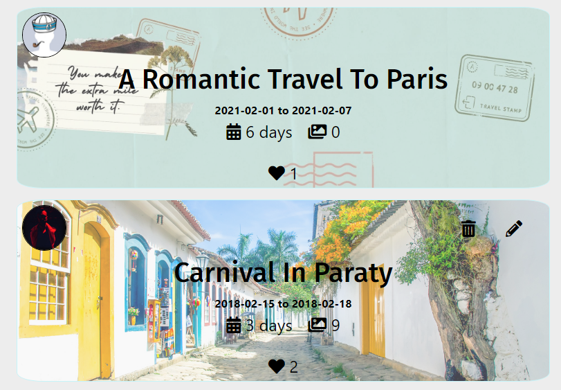


### Validating The HTML and CSS code
  
  #### HTML

  All pages checked. All errors and warnings fixed.

  * [W3C HTML Validator](https://validator.w3.org/) - In the first Check  some erros and warning were found, like:
    * Legend element can't be inside a div, referent to Sign up and Log in form modals. The legend elements in the Sign up and Log in modals were changed to h3 elements;
    * Were found duplicated IDs (startDate, endDate, totalDays and totalPhotos) in the trip posts, referent to trip post template (_post.html), which is used in a loop and it generates the duplicated IDs error. For each id was added the 'trip id' from the data base, then each id is different in each post. Exemple:
      * Before :
        ```html
        <span id="startDate">{{ trip['trip_startdate'].strftime('%Y-%m-%d') }}</span>)
        ```
        It results in duplicated ID's when the database is iterated and the trip posts are rendered.

      * After :
        ```html
        <span id="startDate_{{ trip._id }}">{{ trip['trip_startdate'].strftime('%Y-%m-%d') }}</span>)
        ```
        It results in different ID's when the database is iterated and the trip posts are rendered.
  
  In the second check was found a typo error, in the maxlength and minlength attribute of some input elements. This error was fixed.


  #### CSS3

  * [W3C CSS Validator](https://jigsaw.w3.org/css-validator/) - No error found in the style sheet.

  #### JavaScript

  * [JShint](https://jshint.com/) - "Metrics: There are 20 functions in this file. Function with the Largest function has 13 statements in it, while the median is 1. The most complex function has a cyclomatic complexity value of 5 while the median is 1."

    ##### Common warnings:

    * "'arrow function syntax (=>)' is only available in ES6 (use 'esversion: 6').";
    * "'let' is available in ES6 (use 'esversion: 6') or Mozilla JS extensions (use moz).";
    * "'const' is available in ES6 (use 'esversion: 6') or Mozilla JS extensions (use moz).";
    * "'template literal syntax' is only available in ES6 (use 'esversion: 6')."
    * This code works well despite these warnings

    ##### Two undefined variables:

    * '$' - This is for jQuery, is a sign to define/access jQuery;
    * 'modal' - Which is a function to handle the modals;

* [JSesprima](https://esprima.org/demo/validate.html) - "Code is syntactically valid."

### Testing in different browsers

I manually tested the website on the following web browsers, checking that buttons, responsiveness and design worked as planned:

  * Google Chrome
  * Mozilla Firefox
  * Microsoft Edge

### Testing responsiveness

I manually tested the live project by doing the following:
  
  * Using Google Developer Tools to view the project on devices with different screen sizes.
  * Asking for feedback from friends and family who opened and interacted with the project on their devices.

### Issues found

  1. The Unfollow button in public profile page, when clicked all code related to remove user from the specific field in the database works well and the button UI turn to a Follow Button, but it does not behave as a Follow button unless the page is reloaded.

  2. In case an user is logged with two pages opened in different tabs and one of theses pages is the profile page, if the user log out in the tab that isn't the profile and after try to reload the profile page, then he would see a KeyError error, because there is no longer any session called 'user'. This error was fixed adding a try/except statement in every page that needs a user logged to be used, if there is no longer session 'user', then redirect to feed page, which does not need the session 'user'.

  3. If a user create a trip where the place name does not exists in the country, the google maps is not rendered.

  4. Unfollow link in Following tab (profile page) and Remove Follower in the Followers tab (profile page), just work with a double click.

  5. Icons from google maps are not rendering.

Back to the [Tables of Contents](#tables-of-contents)

---

## Accessibility

  * Each image has an alt attribute describing the image's function
  * Each anchor tag has an aria-label attribute describing where that link goes
  * Each section has an aria-labelledby attribute
  * Content has a contrast with the background to improve the visibility
  * Form inputs have labels

Back to the [Tables of Contents](#tables-of-contents)
---

## Deployment

### Local Deployment

Please note - in order to run this project locally on your own system, you will need the following installed:
  * [Python3](https://www.python.org/downloads/) to run the application.
  * [PIP](https://pip.pypa.io/en/stable/installation/) to install all app requirements.
  * Any IDE such as [Microsoft Visual Studio Code](https://code.visualstudio.com/).
  * [GIT](https://www.atlassian.com/git/tutorials/install-git) for cloning and version control.
  * [MongoDb](https://www.mongodb.com) to develop your own database either locally or remotely on MongoDB Atlas.

Next, there's a series of steps to take in order to proceed with local deployment:

  * Clone this GitHub repository by either clicking the green Clone or download button and downloading the project as a zip-file (remember to unzip it first), or by entering the following into the Git CLI terminal:
    * > git clone https://github.com/SanclerZanella/borderless_project.git

  * Navigate to the correct file location after unpacking the files.
    * > cd <path to folder>
  
  * Create a .env file with your credentials. An example can be found [here](.env_sample). Be sure to include your MONGO_URI and SECRET_KEY values.

  * Create a .flaskenv file and add the following entries:
    * > FLASK_APP=run.py
    * > FLASK_ENV=development
  
  * Install all requirements from the [requirements.txt](requirements.txt) file using this command:
    * > sudo -H pip3 -r requirements.txt
  
  * Sign up for a free account on [MongoDB](https://www.mongodb.com) and create a new Database called 2BN-Desserts. The Collections in that database should be as in the schema:
    * [Database Schema](app/static/files/readme/NoSQL_Schema.pdf)

  * You should now be able to launch your app using the following command in your terminal:
   * > flask run

  * The app should now be running on localhost on an address similar to http://127.0.0.1:5000. Simply copy/paste this into the browser of your choice!

Back to the [Tables of Contents](#tables-of-contents)

### Remote Deployment

This site is currently deployed on [Heroku](https://circleci.com/signup/?gclid=CjwKCAjw9uKIBhA8EiwAYPUS3Jo8VIjh71KAycLOnAlgya-XRQB5GyYpVMR-wvLIxuVPrR3sgcD2bRoCZS0QAvD_BwE) using the master branch on GitHub. To implement this project on Heroku, the following steps were taken:

1. Create a requirements.txt file so Heroku can install the required dependencies to run the app.
    * > pip3 freeze --local > requirements.txt
    * My file can be found [here](requirements.txt).

2. Create a Procfile to tell Heroku what type of application is being deployed, and how to run it.
    * > echo web: python run.py > Procfile
    * My file can be found [here](Procfile).

3. Sign up for a free Heroku account, create your project app, and click the Deploy tab, at which point you can Connect GitHub as the Deployment Method, and select Enable Automatic Deployment.

4. In the Heroku Settings tab, click on the Reveal Config Vars button to configure environmental variables as follows:
    * IP: 0.0.0.0
    * PORT: 5000
    * MONGO_URI: <database_uri>
    * MONGO_DBNAME: <database_name>
    * SECRET_KEY: <your_own_secret_key>
    * MAP_KEY: <Google_maps_API_key>
    * CLOUDINARY_API_KEY: <Cloudinary_API_key>
    * CLOUDINARY_API_SECRET: <Cloudinary_secret>
    * CLOUDINARY_CLOUD_NAME: <Cloudinary_cloud_name>

5. Your app should be successfully deployed to Heroku at this point.

---

## Cloning a Repository

If you would like to work on my project further you can clone it to your local machine using the following steps:

  1. Scroll to the top of my repository and click on the "clone or download button"
  2. Decide whether you want to clone the project using HTTPS or an SSH key and do the following:
    * HTTPS: click on the checklist icon to the right of the URL
    * SSH key: first click on 'Use SSH' then click on the same icon as above
  3. Open the 'Terminal'
  4. Change the current working directory to the location where you want the cloned directory
  5. Type 'git clone', and then paste the URL you copied earlier.
  6. Press 'Enter' to create your local clone.

You can find both the source of this information and learn more about the process on the following link: [Cloning a Repository](https://docs.github.com/en/github/creating-cloning-and-archiving-repositories/cloning-a-repository)

Back to the [Tables of Contents](#tables-of-contents)

---

## Credits

### Acknowledgements

Thank you to the following people who helped with support, inspiration and guidance at different stages in the project:

  * My mentor [Caleb Mbakwe](https://www.linkedin.com/in/calebmbakwe/?originalSubdomain=ng)
  * [Tim Nelson](https://github.com/TravelTimN) whom I inspired to organize the project and the README file.
  * Code Institute Mentors and Tutors.
  * Code Institute Student Care, which is always Kind.
  * My class on slack.
  * The supportive Code Institute community on Slack.
  * My family and friends for their patience and honest critique throughout.


